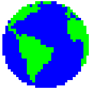

  
  
  

  Senior Backend Engineer with a lot of years building distributed systems, APIs, and cloud infrastructure at scale. 
  Currently working on high-availability trading systems in Go .

  
  
  

 

  

 

  

<!--START_SECTION:waka-->
<!--END_SECTION:waka-->

  <picture>
    <source media="(prefers-color-scheme: dark)" srcset="https://raw.githubusercontent.com/DanielDDHM/DanielDDHM/refs/heads/output/github-snake.svg%20dist/github-snake-dark.svg" />
    <source media="(prefers-color-scheme: light)" srcset="https://raw.githubusercontent.com/DanielDDHM/DanielDDHM/refs/heads/output/github-snake.svg%20dist/github-snake.svg" />
    
  </picture>

