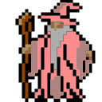

  <!-- Verifique se essa imagem carrega no navegador -->
  
  

  <picture>
    <source media="(prefers-color-scheme: dark)" srcset="https://raw.githubusercontent.com/DanielDDHM/DanielDDHM/refs/heads/output/github-snake.svg%20dist/github-snake-dark.svg" />
    <source media="(prefers-color-scheme: light)" srcset="https://raw.githubusercontent.com/DanielDDHM/DanielDDHM/refs/heads/output/github-snake.svg%20dist/github-snake-dark.svg" />
    
  </picture>

